# Dashboard


## Typography

Paragraph about how we use typography for the dashboard, this could include information about the primary typeface **Lato** 
and the primary weight we use of **400** and not to use anything below *200* because it will be illegible.

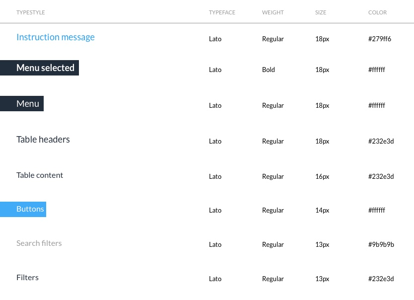

 <h6>Typestyle </h6> | <h6>Typeface </h6>| <h6> Weight</h6>  |  <h6> Size</h6>| <h6> Color</h6> 
 ---|---|---|---|---
<p style="color:#279ff6; font-size:18px"> Instruction Message</p>| Lato | Regular| 18px | #279ff6

``` 
    css{
    font-family: Lato;
    color: #279ff6;
    font-size: 18px;
    weight: regular;
    } 
```  

 <h6>Typestyle </h6> | <h6>Typeface </h6>| <h6> Weight</h6>  |  <h6> Size</h6>| <h6> Color</h6> 
 ---|---|---|---|---
<p style="color:;font-size: 18px;"><b> Menu Selected </b> </p>| Lato  | Bold | 18px |#fffff

```
    h3:active {
    font-family: Lato;
    color: #ffffff
    font-size: 18px;
    weight: bold;
    }
```
 <h6>Typestyle </h6> | <h6>Typeface </h6>| <h6> Weight</h6>  |  <h6> Size</h6>| <h6> Color</h6> 
 ---|---|---|---|---
 <p style="color:;font-size: 18px;"> Menu</p> | Lato | Regular |  18px | #ffffff

    h3:active {
    font-family: Lato;
    color: #ffffff
    font-size: 18px;
    weight: bold;
    }

    h3{
    font-family: Lato;
    color: #ffffff
    font-size: 18px;
    weight: regular;
    }
        


## Color Palette

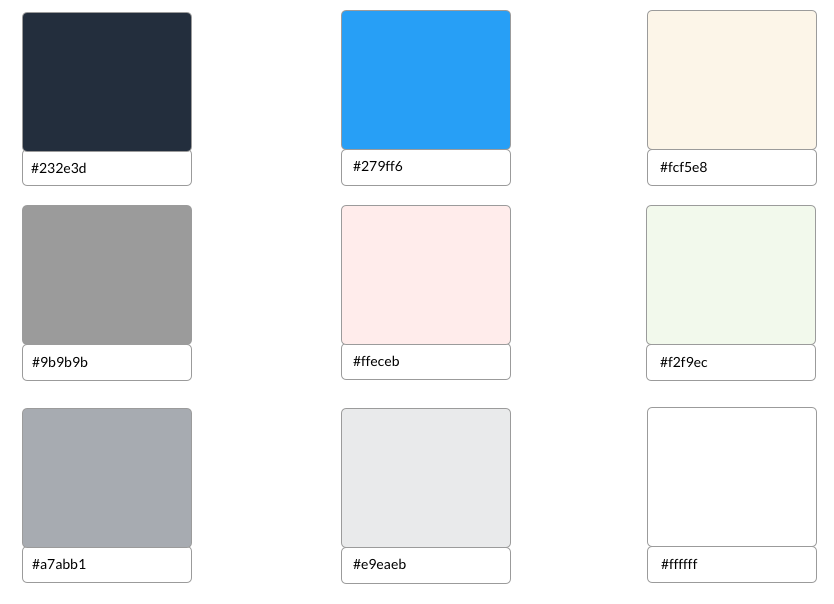 


#### Code Snippet

Here is paragraph about the uses of typography for development we can explain how to use and not to use here  


```js css html here is a code snippet for the code will add it later ```         


## Buttons

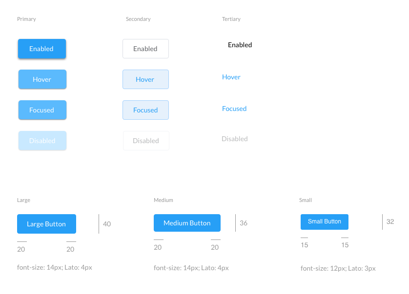 


#### Code Snippet

Here is paragraph about the uses of typography for development we can explain how to use and not to use here  


```js css html here is a code snippet for the code will add it later ```         


## Input States
\
\
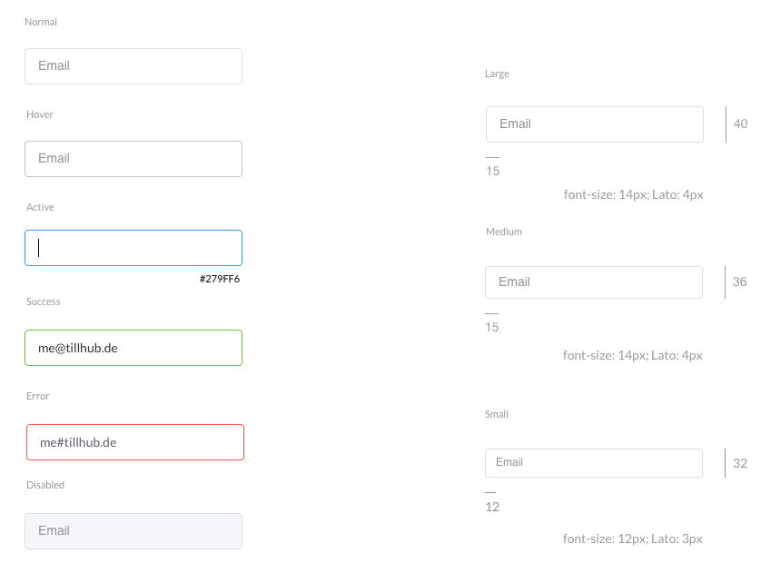 


#### Code Snippet

Here is paragraph about the uses of typography for development we can explain how to use and not to use here  


```js css html here is a code snippet for the code will add it later ```         


## Dropdown Menu
\
\
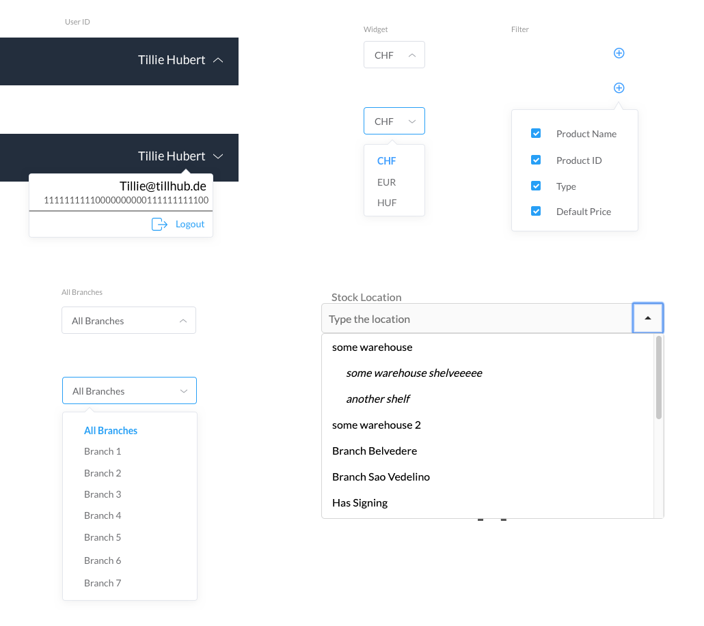 


#### Code Snippet

Here is paragraph about the uses of typography for development we can explain how to use and not to use here  


```js css html here is a code snippet for the code will add it later ```         


## Check Boxes + Radio Buttons 
\
\
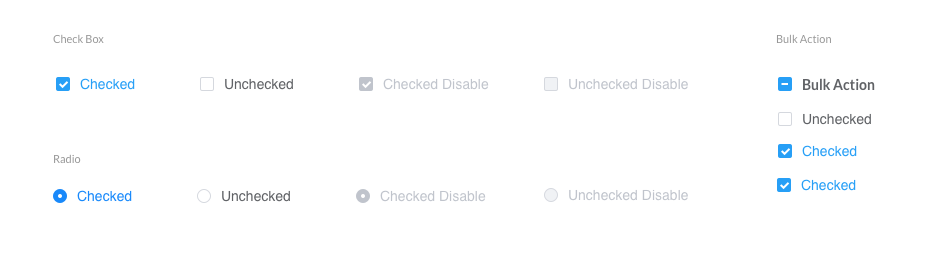 


#### Code Snippet

Here is paragraph about the uses of typography for development we can explain how to use and not to use here  


```js css html here is a code snippet for the code will add it later ```        


## Chips + Toggles
\
\
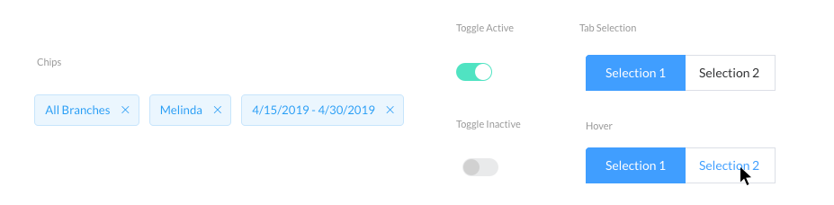 


#### Code Snippet

Here is paragraph about the uses of typography for development we can explain how to use and not to use here  


```js css html here is a code snippet for the code will add it later ```        


## Pagination
\
\
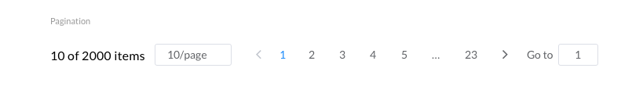 


#### Code Snippet

Here is paragraph about the uses of typography for development we can explain how to use and not to use here  


```js css html here is a code snippet for the code will add it later ```  

## Header
\
\
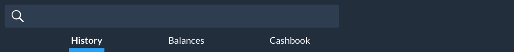 


#### Code Snippet

Here is paragraph about the uses of typography for development we can explain how to use and not to use here  


```js css html here is a code snippet for the code will add it later ```  

## Side Menu
\
\
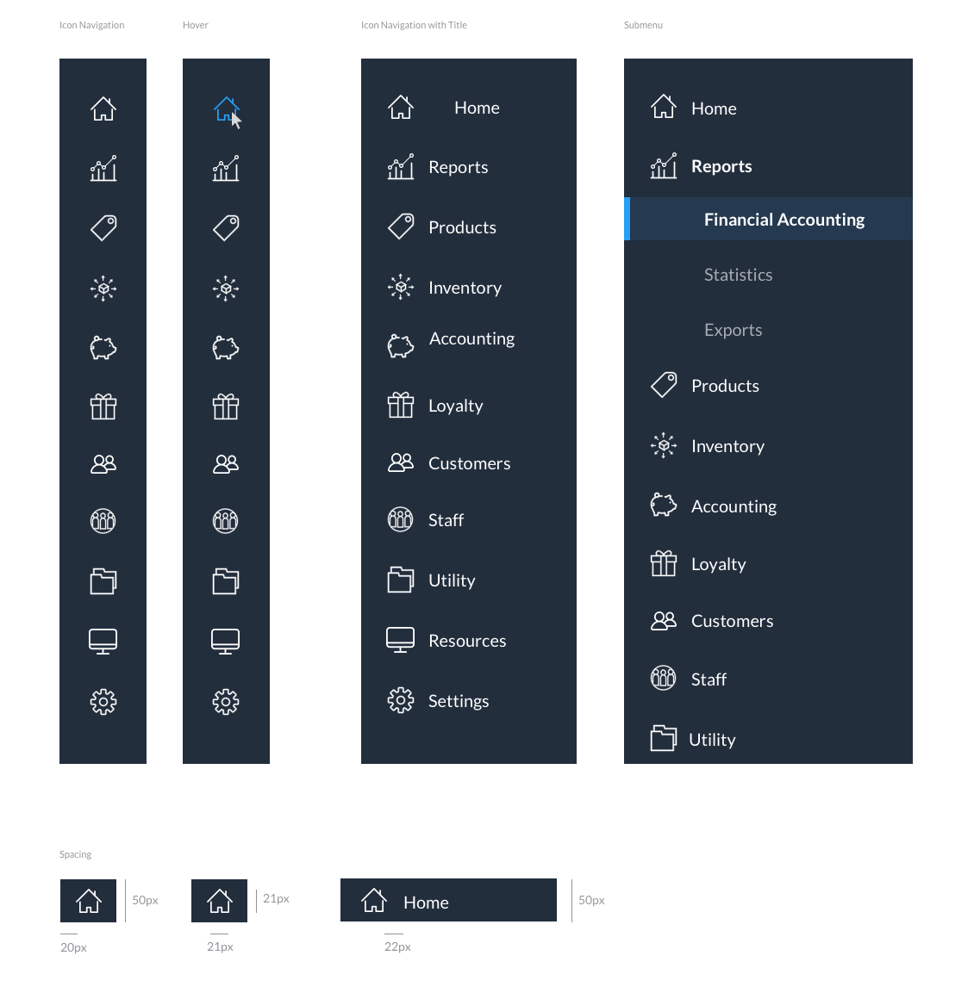 


#### Code Snippet

Here is paragraph about the uses of typography for development we can explain how to use and not to use here  


```js css html here is a code snippet for the code will add it later ``` 

## Tables
\
\
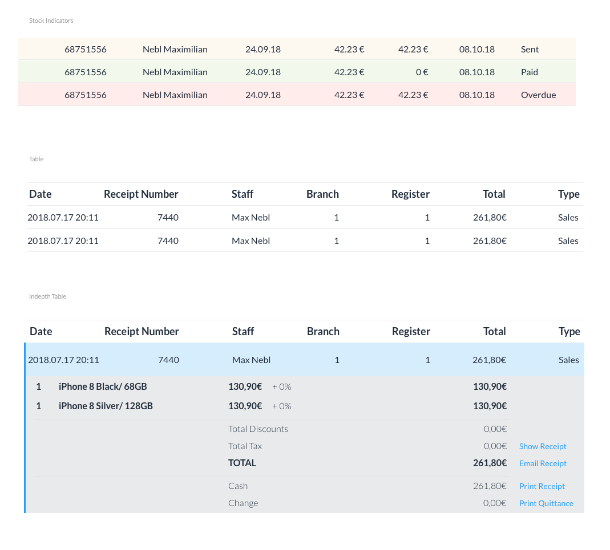 


#### Code Snippet

Here is paragraph about the uses of typography for development we can explain how to use and not to use here  


```js css html here is a code snippet for the code will add it later ``` 


## Notifications
\
\
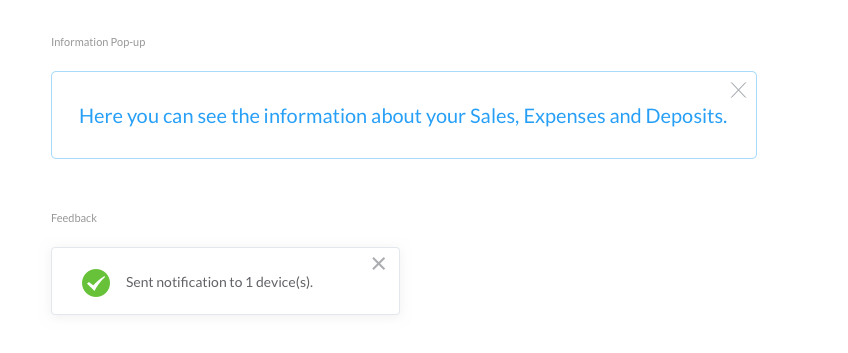 


#### Code Snippet

Here is paragraph about the uses of typography for development we can explain how to use and not to use here  


```js css html here is a code snippet for the code will add it later ``` 

## Analytics
\
\
 


#### Code Snippet

Here is paragraph about the uses of typography for development we can explain how to use and not to use here  


```js css html here is a code snippet for the code will add it later ``` 

## Search Filters
\
\
 


#### Code Snippet

Here is paragraph about the uses of typography for development we can explain how to use and not to use here  


```js css html here is a code snippet for the code will add it later ``` 


## Date Picker
\
\
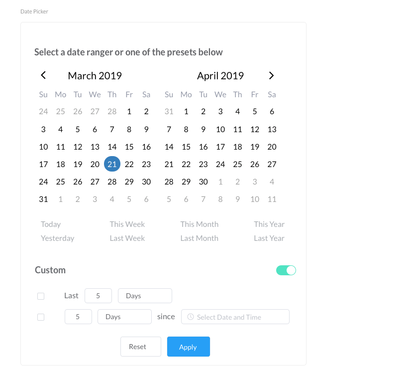 


#### Code Snippet

Here is paragraph about the uses of typography for development we can explain how to use and not to use here  


```js css html here is a code snippet for the code will add it later ``` 