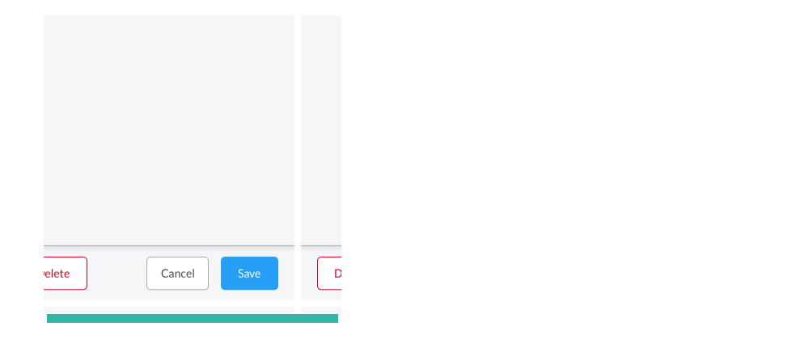
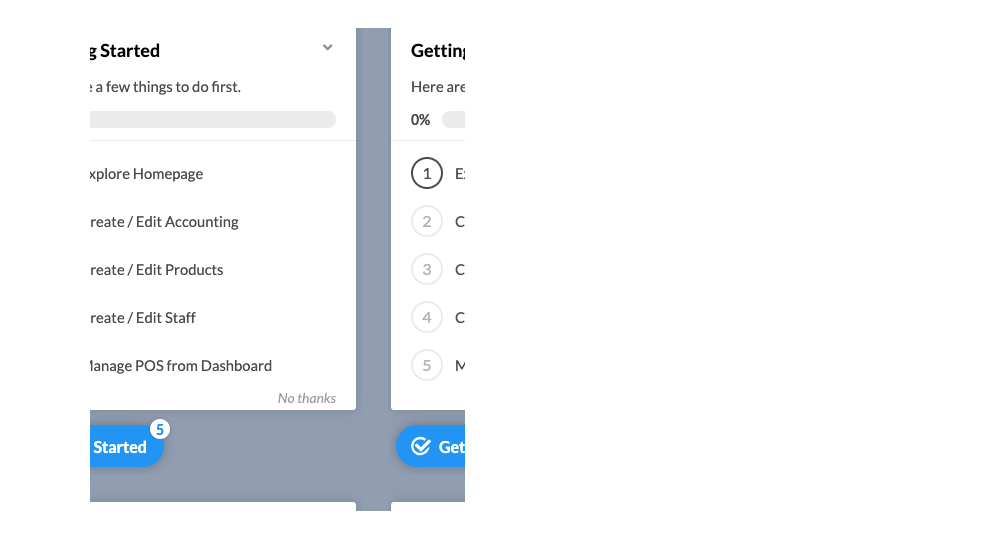
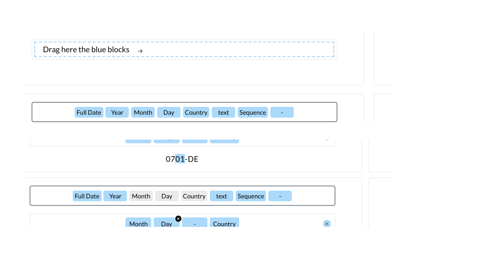
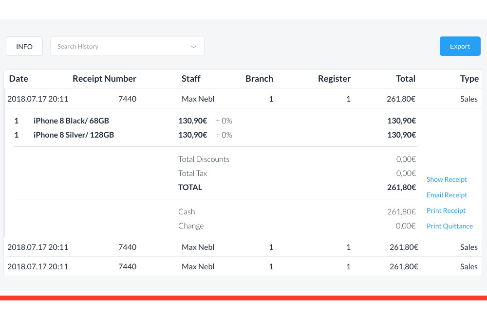

# Dashboard

## Typography

Lato is Tillhub’s primary typeface for the web. Using consistent typefaces and sizes helps maintain a coherent product experience.

## Color Palette

### Usage

We use Obrital Blue on main navigation backgrounds, primary text, and logos. When you need a single color to represent Tillhub use [Dark Blue].
When applying colors to the interface stick with these rules:
* Use Orbital Blue for primary CTA and secondary headers

## Buttons

Buttons are used to communicate importance, each variation has an intention and can be applied to a variety of HTML nodes.

### Primary

### Secondary

### Tertiary 

### Dos + Don'ts

###### Hierarchy

**Do:** In modals with three button options, keep the primary and secondary buttons together and negating button separate. 

**Don't:** Break up primary and secondary buttons with negating buttons. 

### Pagination
We use pagination to indicate a series of related content across multiple pages. 

### Dropdown Search

Tillhub dropdown search component enables the user to find words, sentences, dates, numbers in a collection of products, staff, customers, analytics and other sources. 

### Button Tab 
The button tab component is built upon navs and cards internally. It allows the user to quickly navigate between categorical information. 

### Icons 
Icons must fit in a 24px frame to create consistency across the dashboard.

## Illustrations
Tillhub uses illustration to tell our brand story while encouraging response, explaining complex ideas, provoke delight, or read and learn about the dashboard. An Illustration can easily distract or overwhelm the viewer when used decorative instead it can become distracting hindering usability of the product. 

_Common Places to Use Illustration:_
 - Empty states: error messages or a page has no results
 - Onboarding: explaining the use of a new feature or product

_Signs that you should Use Illustration:_
- Use if the user is frustrated and doesn’t know what to do next
- Features are being bypassed, used incorrectly, or not used at all 
- Text-heavy areas that aren’t being read or understood
- To  congratulate the user or celebrate 
- To speak directly to the user in a more personal way

### Illustrations
When creating an onboarding experience, include an illustration that is explanatory of the action that needs to be taken while keeping the look and feel of the Tillhub brand.  

#### Tone
Use a friendly casual tone that feels relatable and speaks directly to the experience the user will have when configuring or using the feature/product. It’s important to speak directly without overwhelming the user with too much text. Break up text with bold call-outs in black to focus on the direct actions in each section. 

#### Onboarding

When new features or products are launched it’s important to educate our users so that they can be successful.

#### Flow
To design a full onboarding experience create a step by step flow explaining the order in which the user will configure the new feature or product. Use a checklist to give the tour, refrain from placing it over actionable items.

Moving from one checklist item to the next in the flow use “Learn More” to show the user there is more to the tour and giving them the choice to continue or come back to it later.

#### Empty Spaces
When no content is available or an error message occurs filling the space with a visual representation, short descriptive text, and a button to create new or redirect our shop keepers. Using illustration in empty spaces helps communicate, inform or direct our shop keepers to make the next decision.

## Form Elements
Buttons are used to communicate the importance, each variation has an intention and can be applied to a variety of HTML nodes. 

### Input States

### Sizing

### Do's + Don'ts

###### Alignment

**Do:** Input Title should align with Input Field

**Don't:**  Input Title not aligned with Input Field or Too much space between Input Title and Input Field  

###### Spacing + Titles

### Checkboxes

Check Boxes can be used singularly or in bulk action, below is the styling for both instances.  

### Usage

- To select multiple options

### Radio Buttons

### Usage
- Only use to select between two options
- Used in filter modals to conserve space

### Toggle
### Usage

- Use a toggle to choose between two or 3 buttons 

- Use a switch style toggle to turn action on or off

### Chips

### Date Picker

### Drop Zone
Tillhub's ID Generators use a drag and drop component allowing users to create, move around, and customize complex identification numbers for their products,customers, and staff.

## Filters

### Do's + Don'ts

## Modal

### Do's + Don'ts

**Do:** Use a modal if there are 5 or less inputs and components. 

**Don't:** Use a modal if there are more than 5 inputs and components. If the modal is too large to be viewed on the screen and requires scrolling opt for a full page form. 

## Notifications 

### Popover
Popovers are used when an explanation about feature. 

### Alerts
Alerts are visual feedback for our users to know that they have done something successfully, missing some information, or something went wrong with the server. The duration of the alert should span 5 seconds allowing the user to be able to read the notifications. 

###### Success

###### Warning

###### Error 

## Tables

### Columns 
Adding and removing columns is a behavior that customizes table view for our shopkeepers. The dropdown button on the side of the table opens up a drawer of checkboxes. Each checkbox adds or removes specified columns. 

### Rows
The collapsing feature in rows allows users to reveal more information in a table view. 

#### States

Rows can be clickable to edit or view more information, in the case of a clickable row it is necessary to show a hover state of Lunar Grey to visualise the functionality. 

#### Do's + Don'ts

**Do:**  Sufficiently contrast collapsable rows to differentiate the drop down from the table 

**Don't:** Not having contrast on collapsable rows makes,  it difficult for the user to differentiate the collapsable rows from the table 

## Layout 

The following layout patterns are common ways Tillhub arranges the content of the screen. 

### Structure

The dashboard consists of layers of page components and layout components within the app frame. The layout holds cards, components, and banners in a way that responds to different screen sizes. 

###### Desktop
The outer UI is the app frame of the application. It holds global features like top-level navigation and search.

###### iPad 

The outer UI is the app frame of the application. It holds global features like top-level navigation and search and is also collapsible. 

## Margin + Padding

Tillhub’s 5 grid system is the standard for spacing between components, component heights, tables spacing, icons, margins, and padding. By using multiples of 5 it makes it easier to make design and development decisions while keeping a cohesive aesthetic. 

### Tables

Each cell on a standard view of a table has 10px spacing above and below.

On a dropdown  view, cells alternate between 15px and 10px between cells. 

### Forms

### Widgets

