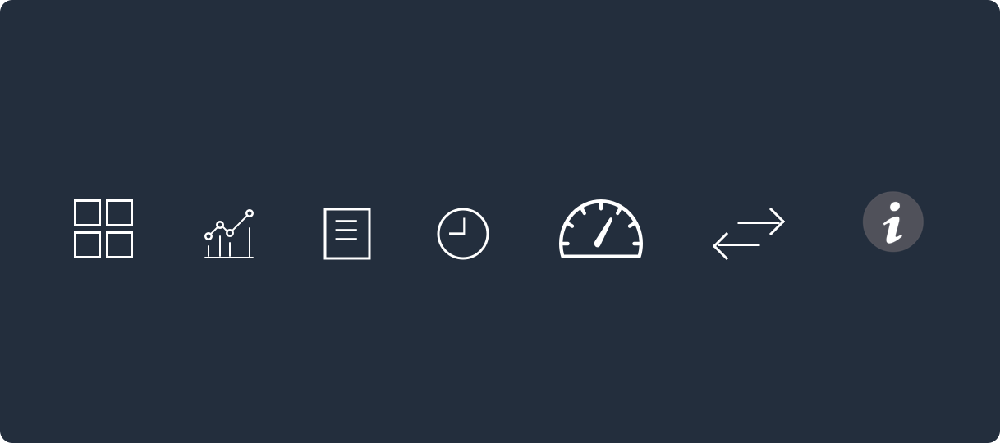
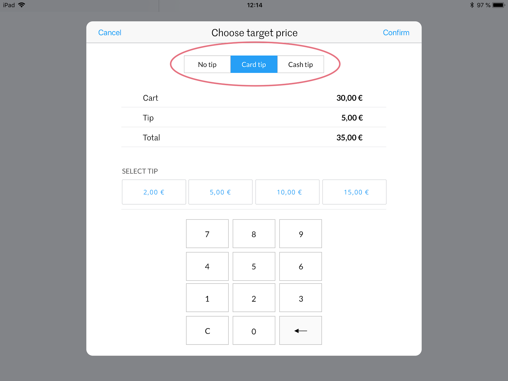

# IOS Resolution Specifications 

## Device Asset Resolution (table) 

## Typography

iOS uses two typfaces, Marr Sans and Lato. Marr Sans is our display typeface and is used for titles and headers. Lato is for body copy, button copy and any other content that is longer than a couple of words. 

#### Display (table)

### Body Copy (table)

## Buttons

### 35px
#

###### Tileset

###### Cart

### 45px
#

###### Cart

###### Close Register 

###### End Sale

###### History

###### Login

###### Filters

###### Product Sets

###### Checkout

### 50px
#

###### Cash Payment 

### 100px
#

###### Variants

## Icons 

### Navigation Menu

### Tab Bar

### Cart

### History

### Library 

### Control

### Settings

## UI Popovers

### Accessibility 

### Cart Actions

## Slider

### Saved Carts + Delivery Notes 

## Stepper 

### Accessibility 

## Segmented Controls

### Expenses + Deposits 

### Tips

## Layout

### App Frame 

### Tiles 

## Page Components

### Cart

### Workspace

### Library

### History

### Arranging Content

### Single Content

## Behaviors 

### Long Press to Organize Tiles

Replicating the iOS press and hold interaction, the POS uses it in edit mode to organize and delete product tiles. 

## Multi-Directional Swipe

Different swiping is done for different actions, in particular, contradictory actions work best using opposite sides of the screen. For example, edit on the left and delete on the right. 

### Long Swipe
The long swipe is a feature Tillhub uses to make deleting a table element faster. With a short swipe, it must be clicked again to make the choice to delete. A long swipe can remove the step of the click, instantly deleting the table item. 

## Pull to Refresh 

Pull to refresh is used to retrieve the latest data from the server. This functionality can be added to a screen that doesn't automatically retrieve data. 

## Drilling in

Drilling in is a standard navigation presentations on iOS. It's used for moving down the app's navigation hierarchy, for example, moving from a customer list to a detail screen. Remember to reverse the navigation when moving back up the hierarchy. 

## Alerts

Alerts are visual feedback for our users to know that they have done something successfully, they've forgotten to input information, or something went wrong with the server. The duration of the alert should psan 5 seconds allowing the user to be able to read the notification. 

###### Success

###### Warning

###### Error 

## Modals 

Modals present from the bottom to the center. 

Modals are used for:
- Saving and discarding changes
- Providing detailed information and help on how to continue
- Creating or editing a resource (product, function, customer, etc.)

## Table View

### Scan

### Cart

### Library

### Saved Carts 

### Balance

### Payment Methods

### Customer History

## Stack View

### Customers 

### Discounts 

### Dos and Don'ts 

**Do:** Align text vertically in line with icon, when there are 1 to 4 lines the same vertical center alignment stays the same.  

**Don't:** Give a specific placement for titles and body copy, this throws off the vertical alignment. 

**Do:** Align text vertically in each cell no matter if it's 1 line or 4 lines. 

**Don't:** Format text line placement the same in each cell, it leaves to much white space when there is only one line present 

![])(assets/dodiscount.png)
**Do:** Align text vertically in line with icon, when there are two lines the same vertical center alignment stays the same.  

**Don’t:** Give a specific placement for titles and body copy, this throws off the vertical alignment. 

## Collection View 

### Tiles

### Tabs

### Counting Helper

### Balance Counter

### Switch User

## Split View

### Library 

### History

### Expenses + Deposits

### Saved Carts + Delivery Notes 

### Settings

## Titles 

### Formatting 

Having image and text formatting guidelines decreases the cognitive load of the user looking at their sale's screen. Images and text show be aligned between the different types of tiles. 

###### Discounts

  

When formatting a discount tile, the image should be placed slightly above the halfway mark, this way the text will not fall to the bottom of the tile letting it align properly with the other types of tiles. 

###### Functions

 

Function tiles are identified with a colored strip on the bottom half of the tile. The text header is fixed to the top third of the section, and the second line is fixed to the bottom third of the section. When an image is uploaded it will sit behind the text block centered. 

###### Product + Variant

  

Product tiles let the cashier know at a glance the type of product they are selling. The tile is 50% text, 50% empty space or image. When an image is uploaded the text space is 905 opaque and the image fills up the whole space. 

## Images

### Add Product

### Add Customer

## Pickers

### Country

### Birthday

### Date 

##Avatars

A placeholder image for customers and users: cashiers and salespeople. 

## Switches / Toggles

Use Tillhub blue to be consistent with the brand identity, instead of th iOS default color. 

###### On

###### Off

## Illustrations

## Numpads

###### Quantity 

###### Scan Item

###### Book Expense

###### Close Register

## Receipt

## Information Grouping

On long form if input doesn't require large amounts of text, place inline instead of listing to avoid endless scrolling. Grouping information helps break up information creating sections. 

**Do:** Use short input fields when a form is extensive. Shortening the input fields makes the form shorter creates less scrolling for the user.

**Don’t:** Use short input fields when the form is short it creates a better experience for the user by creating a more aesthetically pleasing form with less clutter. 